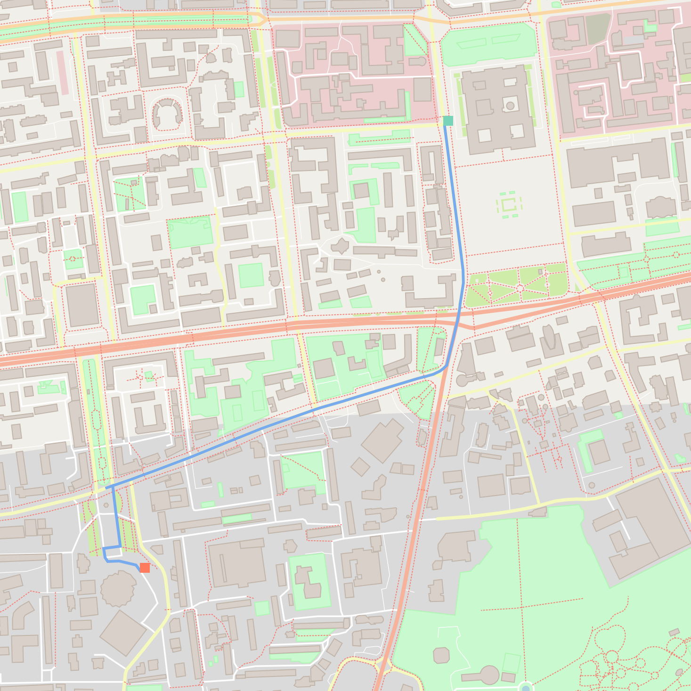

[Table of Contents](https://github.com/federicomariamassari/udacity-cppnd/blob/master/README.md) | Next: [P2 System Monitor]()

# C++ Nanodegree: P1 Build an OpenStreetMap Route Planner
__Federico Massari__

## Map area
Ulaanbaatar, Mongolia (City Centre)

<td align="center"></td>
